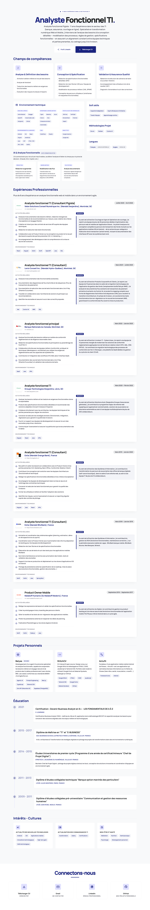

# StitchCV

> Interactive and responsive CV for a Functional Analyst, built with HTML5, CSS3, JavaScript & Tailwind CSS.

[](https://developer.mozilla.org/en-US/docs/Web/HTML)
[](https://developer.mozilla.org/en-US/docs/Web/CSS)
[](https://developer.mozilla.org/en-US/docs/Web/JavaScript)
[](https://tailwindcss.com/)



## Overview

**StitchCV** is a modern web portfolio featuring a **Mobile-First** approach and a polished visual identity based on **Material Design 3** principles.

- ✅ Fully responsive design (mobile, tablet, desktop)
- ✅ Dark / light mode toggle with persistence
- ✅ Bilingual: French & English
- ✅ Print-optimized (`@media print` dedicated styles)
- ✅ Interactive chatbot with built-in FAQ
- ✅ Material Symbols & Google Fonts (Manrope) typography

## Quick Start

No build tools or dependencies required. This project uses Tailwind CSS via CDN.

```bash
git clone https://github.com/daav-23/StitchCV.git
cd StitchCV

# Open directly in your browser
open index-en.html      # macOS
xdg-open index-en.html  # Linux
start index-en.html     # Windows
```

Or serve locally:

```bash
# With Python 3
python -m http.server 8000

# With Node.js (if installed)
npx serve .
```

Then open: http://localhost:8000

## Project Structure

```
StitchCV/
├── index.html              # French version
├── index-en.html           # English version
├── CV_Davy_Gnanavelan_Pigiste.pdf  # Downloadable PDF version
├── logo_entreprise/        # Company logos
│   ├── banquenationale.png
│   ├── bforbank.png
│   ├── desjardins.png
│   ├── hydroquebec.png
│   ├── malakoffhumanis.jpg
│   └── orangebank.jpg
└── README.md
```

## Customization

All CV content is directly editable in the HTML files:

- **Personal info**: hero, contact, LinkedIn/GitHub links
- **Experience**: "Professional Experience" section
- **Skills**: Skills, Technical Environment, Soft Skills blocks
- **Projects**: "Key Projects" section
- **Education**: Education timeline

The color palette and dark theme are configured via the Tailwind script at the top of each file:

```javascript
// Tailwind config excerpt
tailwind.config = {
  darkMode: "class",
  theme: {
    extend: {
      colors: {
        "primary": "#1A237E",
        "dark-surface": "#121316",
        // ...
      }
    }
  }
}
```

The chatbot and its responses are located in the `chatbotData` JavaScript object at the bottom of each file.

## Features

| Feature | Details |
|---------|---------|
| **Responsive** | CSS Grid + Tailwind, mobile-first breakpoints |
| **Dark Mode** | Manual toggle, `localStorage` persistence with OS fallback |
| **Print Styles** | Hides nav/chatbot/modal, forces white background, A4 layout |
| **Chatbot** | Fixed widget with FAQ, typing animation, calendar button |
| **Accessibility** | Material Symbols icons, proper contrast, keyboard navigation |

## Deployment

Deployed via **GitHub Pages**:

```
https://daav-23.github.io/StitchCV/
```

## Design System

- **Primary**: `#1A237E` (Deep Indigo)
- **Surface**: `#f8f9fa`
- **Typography**: Manrope (Google Fonts)
- **Icons**: Material Symbols (Google Fonts)

## License

This project is open source. Feel free to use it as inspiration for your own CV.

---

*Crafted with ❤️ by [Davy Gnanavelan](https://www.linkedin.com/in/gnanavelandavy)*
